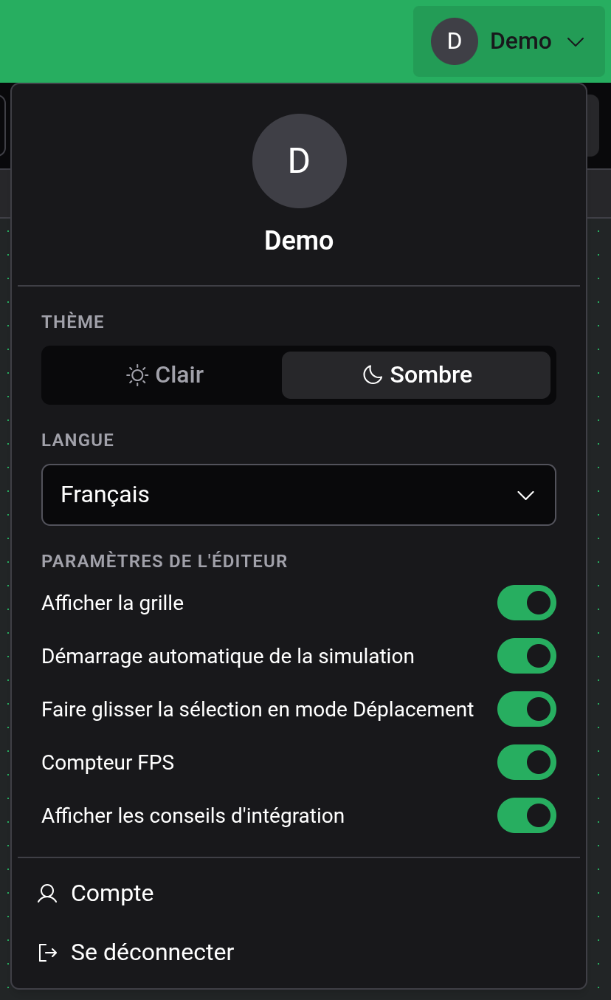

# Paramètres

Tous les paramètres se trouvent dans le menu du compte, ouvert par le bouton de compte à l'extrémité droite de la barre de titre. Dans la disposition tactile, c'est l'avatar en haut à gauche.

## Thème et langue

Thème bascule entre Clair et Sombre. Sombre est la valeur par défaut. Langue propose English, Deutsch, Français et Español. Les deux s'appliquent immédiatement et valent aussi pour le site Logigator : changer la langue dans l'éditeur la change aussi sur le site, et inversement.

## Paramètres de l'éditeur

| Paramètre                                      | Par défaut | Effet                                                                                                                    |
| ---------------------------------------------- | ---------- | ------------------------------------------------------------------------------------------------------------------------ |
| Afficher la grille                             | activé     | Dessine la grille de points. Les composants s'alignent sur la grille dans tous les cas.                                  |
| Démarrage automatique de la simulation         | activé     | Lance le circuit dès que vous entrez en [simulation](docs:simulation). Désactivé, elle attend en pause au tick 0.        |
| Faire glisser la sélection en mode Déplacement | activé     | Un glisser avec Déplacement qui commence dans la sélection déplace la sélection. Désactivé, tout glisser déplace la vue. |
| Compteur FPS                                   | désactivé  | Affiche les images par seconde dans le coin du plan de travail.                                                          |
| Afficher les conseils d'intégration            | activé     | Affiche un conseil la première fois que vous utilisez certains outils. Voir [Prise en main](docs:getting-started).       |

Ces cinq paramètres, vos raccourcis clavier et l'état de la minicarte sont enregistrés uniquement dans ce navigateur. Un autre navigateur ou appareil démarre avec les valeurs par défaut, et effacer les données du site les réinitialise.

## Voir aussi

- [Prise en main](docs:getting-started) : le tutoriel et les conseils
- [Simulation](docs:simulation) : où agit le démarrage automatique
- [Cloud et partage](docs:cloud) : connexion et compte
