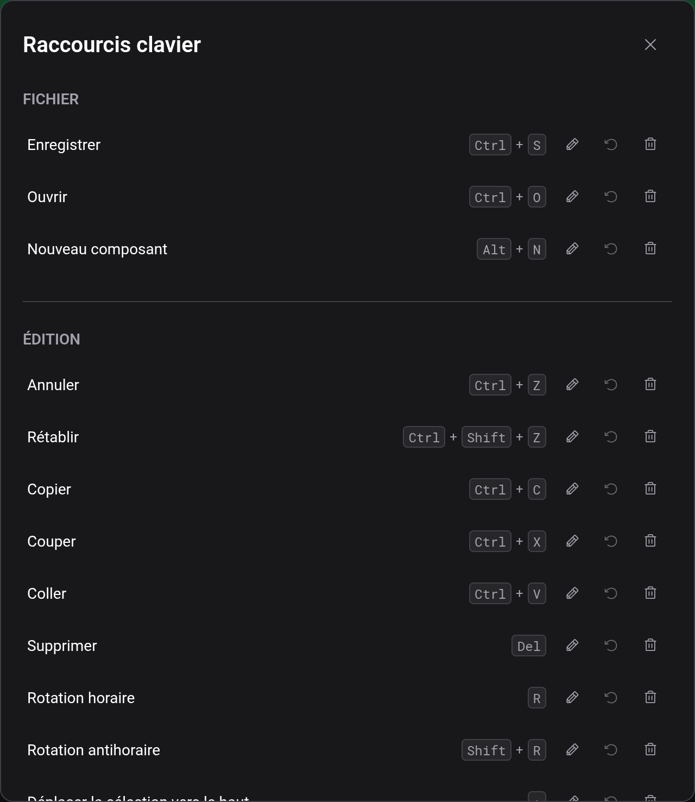

# Raccourcis clavier

Logigator est plus rapide au clavier. Vous trouverez ci-dessous les raccourcis par défaut, suivis de la façon de les modifier.

> Sur macOS, les raccourcis `Ctrl` utilisent la touche **⌘ Commande** à la place — par exemple, Enregistrer est `⌘S`.

## Fichier

| Action            | Raccourci |
| ----------------- | --------- |
| Enregistrer       | `Ctrl+S`  |
| Ouvrir            | `Ctrl+O`  |
| Nouveau composant | `Alt+N`   |

## Édition

| Action                               | Raccourci      |
| ------------------------------------ | -------------- |
| Annuler                              | `Ctrl+Z`       |
| Rétablir                             | `Ctrl+Shift+Z` |
| Copier                               | `Ctrl+C`       |
| Couper                               | `Ctrl+X`       |
| Coller                               | `Ctrl+V`       |
| Supprimer                            | `Delete`       |
| Rotation horaire                     | `R`            |
| Rotation antihoraire                 | `Shift+R`      |
| Déplacer la sélection vers le haut   | `↑`            |
| Déplacer la sélection vers le bas    | `↓`            |
| Déplacer la sélection vers la gauche | `←`            |
| Déplacer la sélection vers la droite | `→`            |

## Affichage

| Action       | Raccourci |
| ------------ | --------- |
| Zoom avant   | `Ctrl++`  |
| Zoom arrière | `Ctrl+-`  |
| Zoom 100 %   | `Ctrl+0`  |

## Outils

| Action                                              | Raccourci |
| --------------------------------------------------- | --------- |
| Déplacement                                         | `P`       |
| Outil fil                                           | `W`       |
| Sélection                                           | `S`       |
| Effacer                                             | `E`       |
| Placer du texte                                     | `T`       |
| Couper les fils au bord de la sélection (maintenir) | `Alt`     |

## Interaction

| Action                           | Raccourci |
| -------------------------------- | --------- |
| Démarrer / Arrêter la simulation | `Enter`   |
| Annuler                          | `Escape`  |

## Raccourcis maintenus

La plupart des raccourcis se déclenchent une fois lorsque vous appuyez dessus. Quelques-uns sont **maintenus** à la place : vous gardez la touche enfoncée pendant que vous faites autre chose. Le principal est **Couper les fils au bord de la sélection** — maintenez `Alt` pendant que vous faites glisser un cadre de sélection avec l'[outil de sélection](docs:board-and-tools) et les fils sont coupés au bord du cadre tant que la touche reste enfoncée.

## Modifier vos raccourcis

Ouvrez **Édition → Raccourcis clavier** pour voir chaque action et son raccourci actuel.

Pour chaque action, vous pouvez :

- **Modifier** — cliquez dessus, puis appuyez sur la combinaison de touches souhaitée. Le gestionnaire enregistre exactement ce que vous appuyez.
- **Désassigner** — laisser une action sans aucun raccourci.
- **Réinitialiser** — restaurer le raccourci par défaut de cette action, ou utiliser **Tout réinitialiser** pour restaurer tous les raccourcis par défaut.

Si vous assignez une combinaison déjà utilisée par une autre action, elle est retirée à cette action (Logigator vous indique laquelle) afin que deux actions ne partagent jamais un raccourci.

Vos raccourcis personnalisés sont mémorisés dans ce navigateur. Effacer les données de site du navigateur les réinitialise aux valeurs par défaut.

## Voir aussi

- [Plan de travail et outils](docs:board-and-tools) — les outils et actions que ces raccourcis déclenchent
- [Prise en main](docs:getting-started) — une visite guidée de l'éditeur
