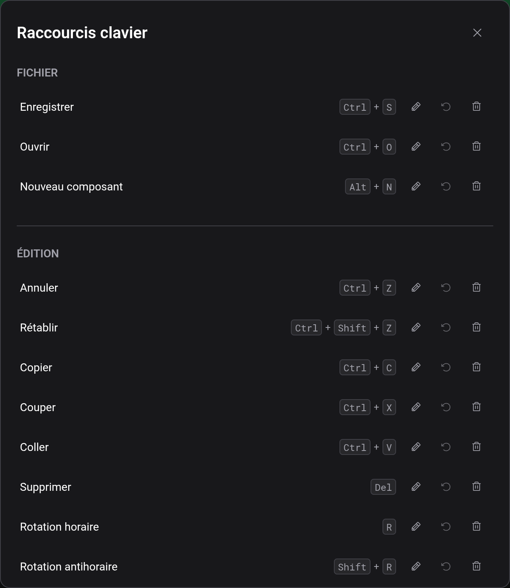

# Raccourcis clavier

Voici les raccourcis par défaut, dans l'ordre où Édition → Raccourcis clavier les liste. Sur Mac, `⌘` fonctionne partout où le tableau indique `Ctrl`, et `Ctrl` fonctionne aussi.

## Raccourcis par défaut

| Action                                                     | Par défaut     |
| ---------------------------------------------------------- | -------------- |
| Enregistrer                                                | `Ctrl+S`       |
| Ouvrir                                                     | `Ctrl+O`       |
| Nouveau composant                                          | `Alt+N`        |
| Annuler                                                    | `Ctrl+Z`       |
| Rétablir                                                   | `Ctrl+Shift+Z` |
| Copier                                                     | `Ctrl+C`       |
| Couper                                                     | `Ctrl+X`       |
| Coller                                                     | `Ctrl+V`       |
| Supprimer                                                  | `Delete`       |
| Rotation horaire                                           | `R`            |
| Rotation antihoraire                                       | `Shift+R`      |
| Déplacer la sélection vers le haut / bas / gauche / droite | flèches        |
| Zoom avant                                                 | `Ctrl++`       |
| Zoom arrière                                               | `Ctrl+-`       |
| Zoom 100 %                                                 | `Ctrl+0`       |
| Déplacement                                                | `P`            |
| Outil fil                                                  | `W`            |
| Sélectionner                                               | `S`            |
| Effacer                                                    | `E`            |
| Placer du texte                                            | `T`            |
| Couper les fils au bord de la sélection (maintenir)        | `Alt`          |
| Ajouter à la sélection ou l'en retirer (maintenir)         | `Ctrl`         |
| Démarrer/Arrêter la simulation                             | `Enter`        |
| Annuler                                                    | `Escape`       |

Pendant la saisie dans un champ de texte, seul `Escape` réagit. Pendant une simulation, les raccourcis d'édition sont désactivés, et `Escape` quitte la simulation.

## Touches maintenues

Les deux actions marquées « maintenir » agissent tant que la touche est enfoncée, au lieu de se déclencher une fois. Maintenez `Alt` en relâchant un cadre de sélection pour couper les fils à son bord (voir [Plan de travail et outils](docs:board-and-tools)). Maintenez `Ctrl` en cliquant ou en traçant un cadre pour ajouter à la sélection ou en retirer. Cela fonctionne avec Sélectionner, Déplacement et l'outil fil.

## Modifier un raccourci

Édition → Raccourcis clavier liste chaque action. Cliquez sur le crayon à côté et appuyez sur la nouvelle combinaison. `Escape` annule l'enregistrement, et ne peut donc pas être attribué à autre chose. Une touche de modification seule, comme `Alt`, ne peut être attribuée qu'aux deux actions maintenues.

Si la combinaison appartient déjà à une autre action, celle-ci la perd et un message indique laquelle. « Réinitialiser » rétablit le raccourci par défaut d'une action, « Désassigner » la laisse sans raccourci, et « Tout réinitialiser » rétablit tous les raccourcis par défaut.

Vos raccourcis sont enregistrés dans ce navigateur. Effacer les données du site les réinitialise.

## Voir aussi

- [Plan de travail et outils](docs:board-and-tools) : les outils et actions derrière ces touches
- [Simulation](docs:simulation) : ce que font Enter et Escape pendant la simulation
