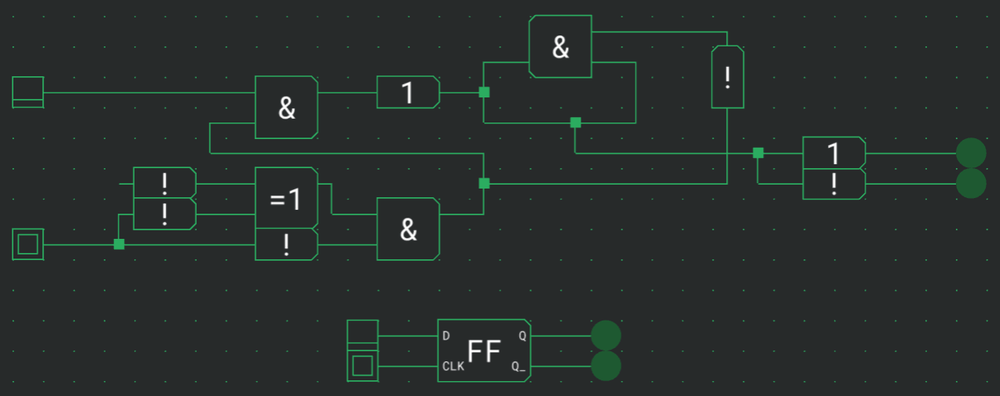
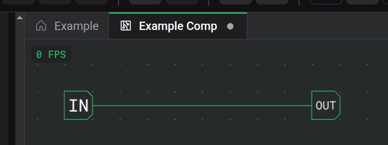

# Benutzerdefinierte Komponenten

Eine benutzerdefinierte Komponente verpackt eine ganze Schaltung in ein einziges wiederverwendbares Bauteil mit eigenem Symbol und benannten Anschlüssen. Baue einen Zähler oder eine ALU einmal und lass sie dann als einen ordentlichen Block in größere Schaltungen fallen.

## Eine Komponente erstellen

Wähle **Datei → Neue Komponente**, um den Dialog für neue Komponenten zu öffnen. Fülle aus:

- **Name** — wie die Komponente in deiner Bibliothek und Palette heißt.
- **Symbol** — eine kurze Beschriftung, die auf dem Kasten der Komponente gezeichnet wird.
- **Beschreibung** — eine optionale Notiz darüber, was sie tut.
- **Speicherort** — wo sie liegt: **Cloud** (dein Logigator-Account, von jedem Gerät erreichbar) oder **Lokal** (nur dieser Browser). Cloud-Speicher erfordert, dass du angemeldet bist; lokale Komponenten werden nicht zwischen Geräten synchronisiert und können verloren gehen.

Die Wahl von **Erstellen** öffnet die neue Komponente in einem eigenen Tab, mit einer leeren Arbeitsfläche, bereit für dich, ihre Schaltung zu bauen.

## Eingänge und Ausgänge definieren

Innerhalb des Editors einer Komponente erhält die Palette eine Kategorie **Anschlüsse** mit zwei Steckern:

- **Eingang** — definiert einen Eingangsanschluss an der fertigen Komponente.
- **Ausgang** — definiert einen Ausgangsanschluss.

Platziere einen Eingangs- oder Ausgangsstecker für jeden gewünschten Anschluss und verdrahte ihn dann wie jede andere Komponente in deine Schaltung. Wähle einen Stecker aus und lege seine **Beschriftung** in der Einstellungskarte fest — diese Beschriftung benennt den Anschluss und wird auf dem Kasten der Komponente angezeigt, wenn sie platziert ist. Die Reihenfolge der Stecker bestimmt die Reihenfolge der Anschlüsse.

Ein eigenes Panel **Anschlüsse** listet die bislang definierten Ein- und Ausgänge auf, sodass du den Überblick behältst, während die Komponente Gestalt annimmt.

## Deine Komponenten platzieren

Gespeicherte benutzerdefinierte Komponenten erscheinen in der Palette unter **Benutzerdefiniert**. Platziere eine genau wie ein eingebautes Bauteil: Klicke sie an und lass sie auf der Arbeitsfläche fallen. Sie erscheint als einzelner Kasten, der dein Symbol trägt, mit einem Anschluss für jeden Eingangs- und Ausgangsstecker, den du definiert hast.

Eine platzierte Komponente ist eine in sich geschlossene Kopie der Schaltung, so wie sie beim Platzieren war, sodass deine Schaltungen weiterfunktionieren, selbst wenn du später das Original änderst oder entfernst.

## Eine Komponente bearbeiten und Instanzen aktualisieren

Um die Schaltung einer benutzerdefinierten Komponente zu ändern, öffne sie in einem eigenen Tab: Wähle **Schaltung bearbeiten** aus ihrer Einstellungskarte, während eine Instanz ausgewählt ist, oder öffne sie aus deiner Bibliothek. Um stattdessen ihren Namen, ihr Symbol oder ihre Beschreibung zu ändern, wähle **Details bearbeiten**. Das Bearbeiten der Komponente ändert **nicht** automatisch bereits platzierte Bauteile — jede platzierte Instanz bleibt, wie sie war.

Wenn eine platzierte Instanz hinter der neuesten Version ihrer Komponente zurückliegt, bietet ihre Einstellungskarte **Auf neueste Version aktualisieren**. Die Wahl dessen tauscht diese Instanz gegen die aktuelle Version aus und behält ihre Position und Richtung. Das Aktualisieren erfolgt pro Instanz und lässt sich rückgängig machen, sodass du genau entscheidest, welche Kopien vorwärtsgehen.

## Verschachtelung und Abhängigkeiten

Eine benutzerdefinierte Komponente kann andere benutzerdefinierte Komponenten enthalten, sodass du von kleinen Bauteilen zu großen aufbauen kannst. Logigator verhindert Schleifen: Eine Komponente kann sich niemals selbst enthalten, weder direkt noch indirekt, sodass während du eine bearbeitest, die Komponenten, die eine solche Schleife erzeugen würden, in der Palette nicht verfügbar sind.

Wenn du eine Komponente speicherst oder teilst, reisen die Bauteile, die sie verwendet, mit ihr, sodass sie auf einem anderen Gerät oder in der Bibliothek einer anderen Person stets vollständig öffnet.

## Teilen und hineinschauen

- Um eine lokale Komponente in deinen Account zu verschieben oder sie mit einem Link zu teilen, siehe [Cloud & Teilen](docs:cloud). Das Speichern einer Cloud-Komponente, die lokale Bauteile verwendet, veröffentlicht diese Bauteile zuerst in deiner Cloud-Bibliothek.
- Um in eine laufende Instanz zu spähen und ihre inneren Signale zu beobachten, siehe [Inspektion & Beobachtungen](docs:inspection).
- Um eine Komponente aus deiner Bibliothek zu entfernen, nutze **Löschen** in ihrer Einstellungskarte. Bereits platzierte Kopien bleiben als eingebettete Bauteile erhalten, die du später wiederherstellen kannst.

## Siehe auch

- [Komponenten & Optionen](docs:components-and-options) — die eingebauten Bauteile, aus denen deine Komponenten bestehen
- [Leitungen & Verbindungen](docs:wires-and-connections) — Stecker in die Schaltung deiner Komponente verdrahten
- [Inspektion & Beobachtungen](docs:inspection) — eine laufende Instanz von innen beobachten
- [Cloud & Teilen](docs:cloud) — deine Komponenten veröffentlichen und teilen
- [Speichern & Dateien](docs:saving-and-files) — wie Schaltungen und ihre Komponenten gespeichert werden
