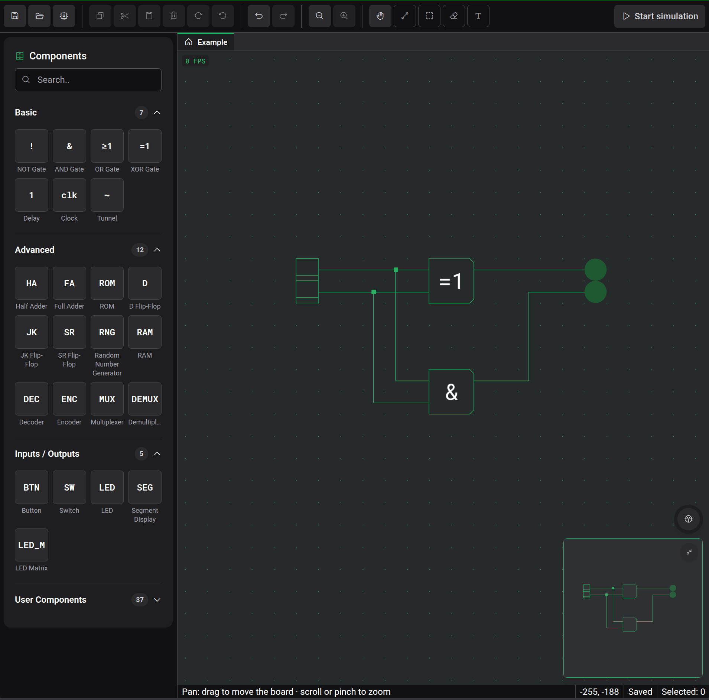
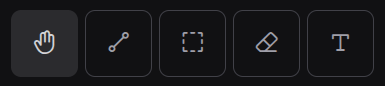
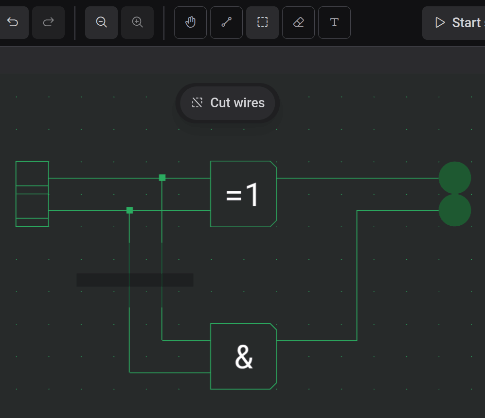

# Board & Tools

The board is the grid where you build your circuit. This page covers how to move around it and how each editing tool works.

## Getting around the board

- **Zoom** — scroll the mouse wheel over the board, or pinch on a touch device. You can also use the zoom buttons in the toolbar, **View → Zoom In / Zoom Out**, or **View → Zoom 100%** to reset to actual size.
- **Pan** — pick the **Pan** tool (the hand) and drag. You can also pan from _any_ tool by dragging with the **right mouse button**, so you rarely need to switch tools just to reposition.
- **Touch** — drag with two fingers to pan and pinch to zoom at any time; a one-finger drag pans only while the Pan tool is active.

The **status bar** at the bottom always shows a short reminder of what the active tool does, plus your cursor's position on the grid.

## The toolbar tools

The right-hand group of the toolbar holds the five drawing tools. Only one is active at a time; each also has a single-key shortcut.

| Tool       | Shortcut | What it does                                                                                                                               |
| ---------- | -------- | ------------------------------------------------------------------------------------------------------------------------------------------ |
| **Pan**    | `P`      | Drag to move the board; scroll or pinch to zoom.                                                                                           |
| **Wire**   | `W`      | Drag to draw wires; tap a port to negate it, or tap a crossing to connect or split. See [Wires & Connections](docs:wires-and-connections). |
| **Select** | `S`      | Drag a box to select elements; drag the selection to move it.                                                                              |
| **Erase**  | `E`      | Click or drag across elements to delete them.                                                                                              |
| **Text**   | `T`      | Place a text label on the board.                                                                                                           |

## Placing components

To add a component, pick it from the [component palette](docs:components-and-options) on the left. A ghost of the component then follows your cursor on the board — move it where you want, then press and release to drop it. Placement stays armed, so you can drop several of the same component in a row. Press `Escape`, or choose another tool, to stop placing.

A component can't be dropped on top of another element; the ghost shows where it will land.

## Selecting, moving and rotating

With the **Select** tool, drag a box (a marquee) over the elements you want. Everything the box touches — components and wires — becomes selected. To move a selection, drag from inside it to a new spot.

Once something is selected you can:

- **Rotate** it — press `R` for clockwise, `Shift+R` for counter-clockwise, or use the rotate buttons in the toolbar.
- **Move** it a single grid step at a time with the **arrow keys**.

Like placing, a move or rotation only commits when the elements land on a free spot.

## Cutting wires at the selection edge

The select tool has a **scissor** mode that trims wires exactly at the edge of your selection box, instead of grabbing whole wires. This is handy for slicing a wire out of the middle of a bus.

A small pill floats above the board while the select tool is active — click it to toggle scissor mode on. On desktop you can also just **hold `Alt`** while dragging the selection box to cut for that one drag; the pill lights up to show the mode is engaged. Anything the box fully contains stays selected, and wires crossing the box edge are cut there.

## Copy, cut, paste and delete

Standard editing works on the current selection:

- **Copy** (`Ctrl+C`) and **Cut** (`Ctrl+X`) put the selection on the clipboard; cut also removes it.
- **Paste** (`Ctrl+V`) brings the copied elements back, slightly offset from the originals. They arrive as a ghost you position — drag them to a free spot and release to drop, or press `Escape` to cancel.
- **Delete** (`Delete`) removes the selection.

These commands are also in the toolbar and the **Edit** menu. Every edit can be undone with **Undo** (`Ctrl+Z`) and redone with **Redo** (`Ctrl+Shift+Z`).

## Erasing

The **Erase** tool (the eraser) is the quickest way to remove things: click an element to delete it, or drag across several to sweep them all away. Press `Escape` mid-drag to cancel and restore what you erased.

## The minimap

The minimap in the bottom-right corner shows your whole circuit at once, with a frame marking the part you're currently viewing — useful for finding your way around a large board. Collapse it with its toggle when you need the space.

## See also

- [Wires & Connections](docs:wires-and-connections) — drawing wires, junctions and toggling connections
- [Components & Options](docs:components-and-options) — the parts you place and configure
- [Keyboard Shortcuts](docs:shortcuts) — change any of the bindings used here
