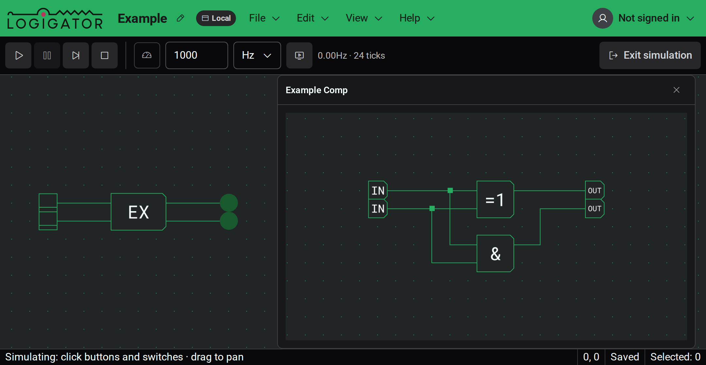

# Inspection & Watches

Some components let you look inside them while your circuit runs. You can read a memory's contents at the address it's currently reading, or open a live, interactive view of a custom component's inner circuit.

Inspection is only available **while a [simulation](docs:simulation) is running**. Enter simulation first, then tap a component that supports inspection to open its view. Tapping it again brings the same view back to the front, and leaving simulation closes everything.

On desktop these views open as floating windows you can drag around and stack over the board. On phones and narrow screens they appear instead as a panel that slides up from the bottom, and watches take over the full screen — the running circuit stays visible and interactive behind them.

## Inspecting memory contents

Tap a **ROM** while the simulation runs to open a read-only viewer of its stored data. The word the circuit is **currently addressing** is highlighted, and updates live as the address changes, so you can follow exactly what the memory is feeding back into the circuit.

The viewer is for reading only — you can't change the contents here. Its controls let you choose how the data is shown:

- **Words / Bytes** — show each stored value whole, or split into individual bytes.
- **Hex / Decimal / Octal / Binary** — the number base every value is shown in.
- **Go to address** — jump straight to a specific address.
- **Follow** — keep the currently-addressed word scrolled into view as the address moves.

An **Address** and **Value** readout shows the highlighted word's address and its contents.

## Watching a custom component's inner circuit

Tap a placed [custom component](docs:custom-components) while the simulation runs to open a **watch** — a live view of the circuit inside it. The inner wires and ports light up exactly as the running circuit drives them, so you can see what's happening one level down without unpacking the component.

A watch is interactive:

- **Drive its inputs** — click a **switch** or **button** inside the watched circuit to operate it, just like on the main board. It drives the real running simulation, so the effect ripples out to the rest of your circuit.
- **Drill into nested components** — tap a custom component inside the watch to descend into _its_ inner circuit. A **breadcrumb** trail across the top shows how deep you are; click an earlier step to jump back out.
- **Pan and zoom** — drag to move around the inner view and scroll or pinch to zoom, the same as on the board.

If a component can't be watched you'll see a short message: it may have **no inner circuit** to inspect, or its inner circuit may no longer match the running simulation — in that case, **restart the simulation** and try again.

> **Compact screens:** watches open as a full-screen view with a back button in place of the window's close button; the breadcrumb still lets you step back through nested levels.

## See also

- [Simulation](docs:simulation) — running your circuit and interacting with it
- [Custom Components](docs:custom-components) — building and using reusable components
- [Components & Options](docs:components-and-options) — memories, switches, buttons and other building blocks
