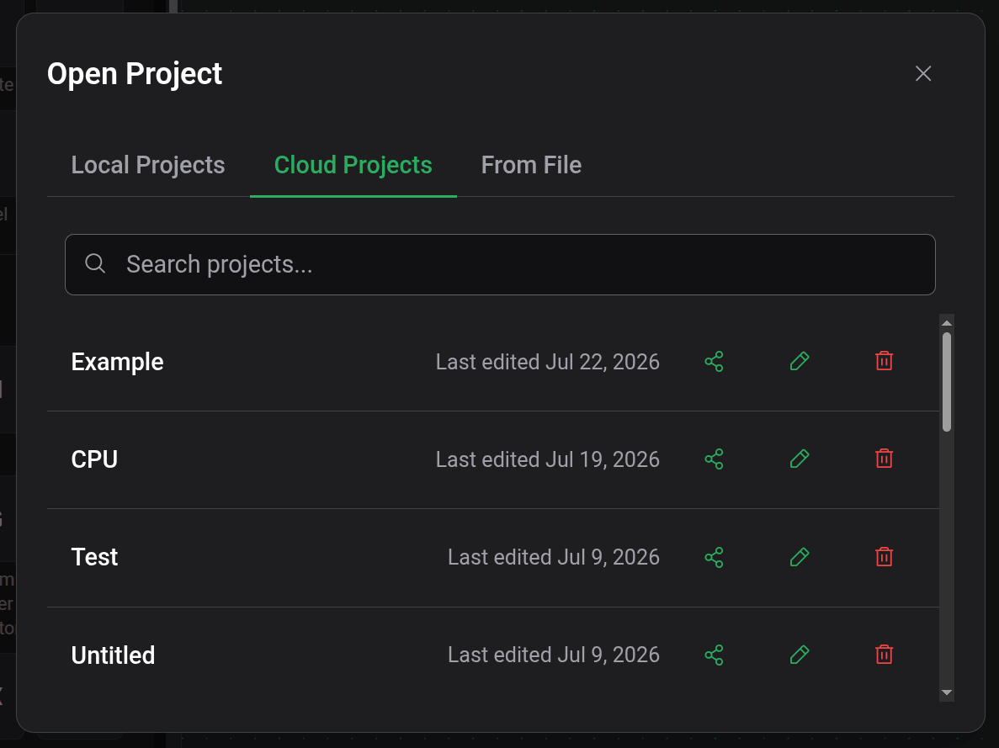
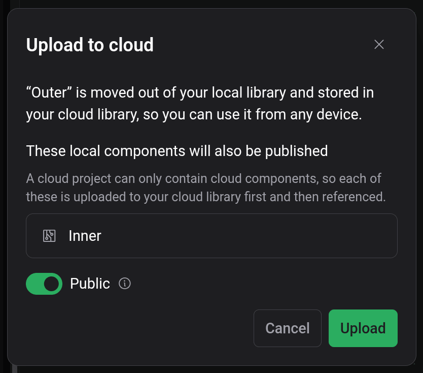
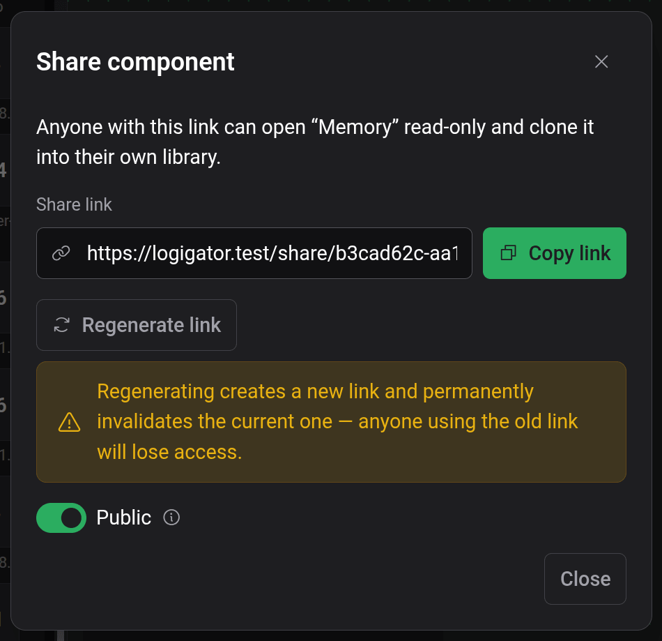

# Nube y compartir

Tu cuenta de Logigator mantiene proyectos y componentes en la nube, accesibles desde cualquier dispositivo, y te permite compartirlos con un enlace. Todo en el editor funciona sin cuenta; iniciar sesión añade almacenamiento en la nube y compartición.

## Iniciar sesión y tu cuenta

Abre el menú de cuenta en la esquina superior derecha. Con la sesión cerrada ofrece **Iniciar sesión**; con la sesión iniciada muestra tu **Cuenta** y una opción de **Cerrar sesión**, junto a los ajustes de **Tema** e **Idioma** (consulta [Ajustes y apariencia](docs:settings)).

Iniciar sesión te da:

- **Almacenamiento en la nube** para proyectos y componentes personalizados, disponible en cada dispositivo desde el que inicies sesión.
- **Enlaces para compartir** de tus proyectos y componentes en la nube.

Cerrar sesión borra tu biblioteca en la nube de esta sesión; tus proyectos locales (del navegador) permanecen en su sitio.

## Almacenamiento local frente al de la nube

Cada proyecto y componente personalizado reside en uno de dos lugares:

- **Local**: almacenado en el navegador que estás usando. Rápido y sin cuenta, pero atado a ese único navegador y sin copia de seguridad.
- **Nube**: almacenado en tu cuenta. Accesible desde cualquier dispositivo una vez que inicias sesión.

La etiqueta junto al nombre del proyecto muestra cuál de los dos usa el proyecto abierto (**Local**, **Nube**, o **Borrador** si aún no se ha guardado). Consulta [Guardar y archivos](docs:saving-and-files) para el flujo de guardado.

El diálogo **Archivo → Abrir** mantiene los dos separados en pestañas distintas —**Proyectos locales** y **Proyectos en la nube**— más una pestaña **Desde archivo** para importar un archivo de circuito. Si tienes la sesión cerrada, la pestaña Proyectos en la nube te pide que inicies sesión.

## Trasladar el trabajo a la nube

Hay dos maneras de llevar un proyecto a tu biblioteca en la nube:

1. **Guardar un Borrador directamente en la nube**: cuando guardas por primera vez un proyecto nuevo, elige **Destino: Nube** en el diálogo de guardado.
2. **Subir un proyecto local existente**: con un proyecto Local guardado abierto, elige **Archivo → Subir a la nube**. También puedes subir un proyecto desde la lista del diálogo **Abrir**.

Subir _traslada_ el proyecto fuera del almacenamiento local a tu biblioteca en la nube. Si el proyecto usa componentes personalizados locales, estos se publican en tu biblioteca en la nube junto con él: un proyecto en la nube solo puede contener componentes en la nube, así que cada uno se sube primero y luego se referencia. El diálogo de subida lista exactamente qué componentes se publicarán antes de que confirmes.

Los componentes personalizados se pueden trasladar a la nube de la misma manera, desde su acción en el panel de ajustes.

## Compartir un proyecto

Una vez que un proyecto está en la nube, **Archivo → Compartir** abre el diálogo de compartir. (Compartir solo está disponible para proyectos en la nube; sube primero un proyecto local.)

- **Enlace para compartir**: cualquiera que tenga el enlace puede abrir tu proyecto en **modo de solo lectura** y **clonarlo en su propia biblioteca** para construir sobre él. Usa **Copiar enlace** para obtenerlo.
- **Público**: un proyecto público también se publica en tu perfil y cualquiera puede descubrirlo. Un proyecto privado es accesible **solo** a través de su enlace para compartir.
- **Regenerar enlace**: crea un enlace nuevo e invalida permanentemente el antiguo; cualquiera que siga usando el enlace antiguo pierde el acceso.

Los componentes personalizados en la nube se pueden compartir de la misma manera desde el panel de ajustes.

### Qué ve el destinatario

Alguien que abre tu enlace para compartir obtiene una copia de **solo lectura**: la etiqueta indica **Compartido** y no puede guardar cambios sobre los tuyos ni exportarlo a un archivo. Para hacerlo suyo, **clona** el proyecto en su biblioteca, lo que le da una copia completa y editable que puede guardar y editar libremente. Su clon es independiente; las ediciones posteriores en cualquiera de los lados no afectan al otro.

## Ajustes de cookies y consentimiento

Cuando Logigator se sirve con su banner de consentimiento, puedes revisar tus preferencias de cookies y consentimiento en cualquier momento desde **Ayuda → Ajustes de cookies**. (Esta entrada solo aparece donde el banner de consentimiento está disponible.)

## Consulta también

- [Guardar y archivos](docs:saving-and-files): guardar localmente, archivos `.lgix` y exportación de imágenes
- [Componentes personalizados](docs:custom-components): las piezas reutilizables que viajan con un proyecto compartido
- [Ajustes y apariencia](docs:settings): ajustes de tema, idioma y cuenta
