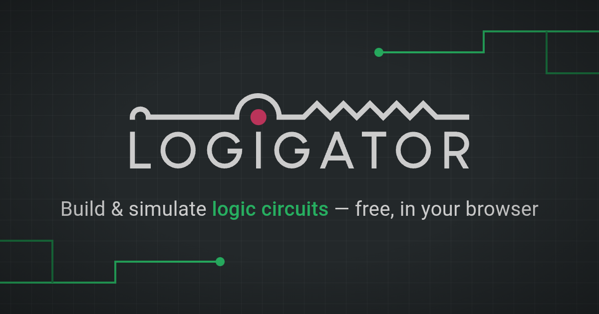
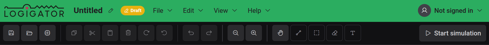

# Primeros pasos

Bienvenido a Logigator: un editor y simulador open source para circuitos lógicos digitales que se ejecuta por completo en tu navegador.

## ¿Qué es Logigator?

Logigator te permite dibujar circuitos lógicos digitales —desde una sola puerta Y hasta un procesador completo— y luego ejecutarlos para ver fluir las señales. Colocas componentes en una cuadrícula, cableas sus puertos entre sí y pulsas reproducir para simular.

Puedes:

- Construir circuitos con puertas lógicas, biestables, memorias, multiplexores, displays y más
- Cablear componentes en redes y ver cómo se iluminan los cables alimentados durante la simulación
- Empaquetar un circuito terminado en tu propio [componente personalizado](docs:custom-components) reutilizable
- Guardar tu trabajo en este navegador, [exportarlo a un archivo](docs:saving-and-files) o conservarlo en tu [cuenta de Logigator en la nube](docs:cloud)

Todo funciona sin cuenta. Iniciar sesión añade almacenamiento en la nube y enlaces para compartir.

## Un recorrido por el editor

El editor está organizado en unas pocas áreas fijas alrededor del tablero central:

- **El tablero**: la cuadrícula del centro donde colocas componentes y dibujas cables. Desplaza para hacer zoom y arrastra para desplazarte.
- **La barra de herramientas** (en la parte superior): acciones rápidas a la izquierda (guardar, abrir, copiar/pegar, deshacer/rehacer, zoom) y las herramientas de dibujo a la derecha (desplazar, cable, seleccionar, borrar, texto). El botón **Iniciar simulación** se sitúa en el extremo derecho.
- **La barra de menús** (arriba a la izquierda): los menús **Archivo**, **Editar**, **Vista** y **Ayuda**. Todos los comandos están aquí, la mayoría con un atajo de teclado mostrado al lado.
- **La paleta de componentes** (panel izquierdo): todos los componentes que puedes colocar, agrupados en categorías. Consulta [Componentes y opciones](docs:components-and-options).
- **La barra de estado** (abajo): una pista de una línea para la herramienta activa, la posición de tu cursor en la cuadrícula, si el proyecto tiene cambios sin guardar y cuántos elementos hay seleccionados.
- **El minimapa** (abajo a la derecha): una vista general de todo el circuito que puedes contraer.

El nombre del proyecto se sitúa junto a los menús en la parte superior; haz clic en él para renombrar el proyecto, y la etiqueta a su lado muestra dónde está almacenado el proyecto (**Local**, **Nube**, **Borrador** o **Compartido**).

## El tutorial guiado

La forma más rápida de aprender lo básico es el tutorial integrado, que te guía en la construcción de un pequeño circuito funcional en aproximadamente un minuto.

La primera vez que abras el editor, aparece una tarjeta cerca de la parte superior del tablero: **«¿Eres nuevo aquí? Construye tu primer circuito en un tutorial rápido.»** Elige **Empezar el tutorial** para comenzar, o **Descartar** para omitirlo. Puedes omitir el tutorial en cualquier momento una vez que haya comenzado.

Para volver a ejecutarlo más adelante —o recuperar los consejos contextuales que se describen abajo— abre **Ayuda → Mostrar los consejos de nuevo**.

## Consejos justo a tiempo

A medida que echas mano de una herramienta por primera vez, Logigator muestra un breve consejo que explica cómo funciona: por ejemplo, cómo la [herramienta de cable](docs:wires-and-connections) dibuja y alterna conexiones, o qué hace la selección de tijera. Cada consejo se puede descartar y no volverá a aparecer una vez que lo hayas visto.

Para desactivar los consejos por completo, abre el menú de cuenta en la esquina superior derecha y desactiva **Mostrar consejos de introducción** en **Ajustes del editor**, o elige **Desactivar todos los consejos** en cualquier consejo. Consulta [Ajustes y apariencia](docs:settings).

## Mantenerse al día con los cambios

Logigator se actualiza con regularidad. Abre **Ayuda → Novedades** para ver un resumen de lo que cambió en las versiones recientes. La primera vez que una nueva versión introduce algo digno de conocer, esto aparece automáticamente.

## Informar de un problema

¿Has encontrado un error? Usa el botón **Informar de un error** en la esquina inferior derecha del tablero. Describe qué estabas haciendo cuando ocurrió: tu proyecto actual, los detalles del navegador y la actividad reciente se adjuntan para ayudar a localizar el problema. Si un error inesperado llegara a interrumpirte, la misma ventana de informe se abre por sí sola.

## Información de versión y licencia

**Ayuda → Acerca de** muestra la versión exacta que estás ejecutando, junto con los detalles de la compilación, la licencia (Logigator es software libre bajo la **GNU AGPL v3**) y enlaces al repositorio de código fuente y a la política de privacidad.

## Consulta también

- [Tablero y herramientas](docs:board-and-tools): moverse, colocar componentes, seleccionar y borrar
- [Componentes y opciones](docs:components-and-options): los bloques de construcción y cómo configurarlos
- [Cables y conexiones](docs:wires-and-connections): conectar componentes en circuitos funcionales
- [Simulación](docs:simulation): ejecutar tu circuito e interactuar con él
- [Atajos de teclado](docs:shortcuts): cada asignación y cómo cambiarla
