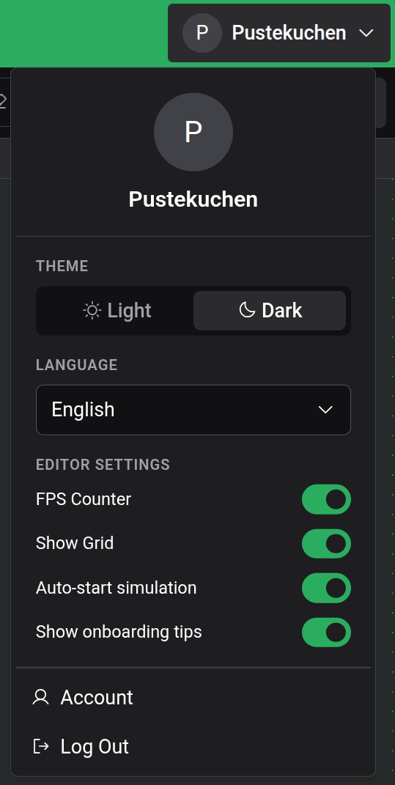

# Ajustes y apariencia

Logigator tiene un puñado de preferencias para adaptar el editor a tu gusto. Las encontrarás todas en un solo lugar: abre el **menú de cuenta** en la esquina superior derecha del editor. (En un teléfono o tableta, abre el menú desde la esquina superior izquierda.)

## Tema

Cambia entre una apariencia **Clara** y una **Oscura**. La elección se aplica de inmediato en todo el editor.

## Idioma

Logigator está disponible en varios idiomas:

- **English** (inglés)
- **Deutsch** (alemán)
- **Français** (francés)
- **Español**

Elige uno del desplegable **Idioma**; la interfaz se actualiza al instante.

## Ajustes del editor

Tres alternancias de encendido/apagado cambian cómo se comporta el tablero:

- **Mostrar cuadrícula**: dibuja la cuadrícula punteada en el tablero. Activada por defecto. Desactívala para un lienzo más limpio; los componentes siguen ajustándose a la cuadrícula de cualquier modo.
- **Contador de FPS**: muestra una pequeña lectura de fotogramas por segundo sobre el tablero. Desactivada por defecto; útil al comprobar el rendimiento en un circuito grande.
- **Iniciar la simulación automáticamente**: cuando está activada (el valor predeterminado), pulsar **Iniciar simulación** empieza a ejecutar el circuito de inmediato. Desactívala para entrar en la [simulación](docs:simulation) en pausa, de modo que puedas avanzar paso a paso desde el primerísimo tick.

## Consejos de introducción

La alternancia **Mostrar consejos de introducción** controla las pistas justo a tiempo que aparecen la primera vez que usas una función. Desactívala para silenciarlas, o vuelve a activarla para verlas de nuevo. El mismo interruptor lo restablece **Ayuda → Mostrar los consejos de nuevo**, que también vuelve a ofrecer el tutorial guiado. Consulta [Primeros pasos](docs:getting-started).

## Dónde se almacenan estos ajustes

Todas estas preferencias —tema, idioma, las alternancias del editor y tus ajustes de consejos— se guardan en **este navegador**, en este dispositivo. No están vinculadas a tu cuenta, así que un navegador o dispositivo distinto parte de los valores predeterminados. Borrar los datos del sitio del navegador las restablece.

## Consulta también

- [Nube y compartir](docs:cloud): tu cuenta, iniciar y cerrar sesión, y el almacenamiento en la nube
- [Primeros pasos](docs:getting-started): el tutorial guiado y un recorrido por el editor
- [Simulación](docs:simulation): dónde surte efecto la opción Iniciar la simulación automáticamente
