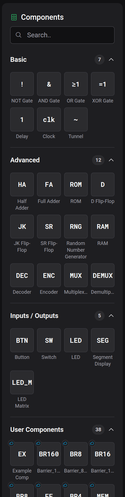
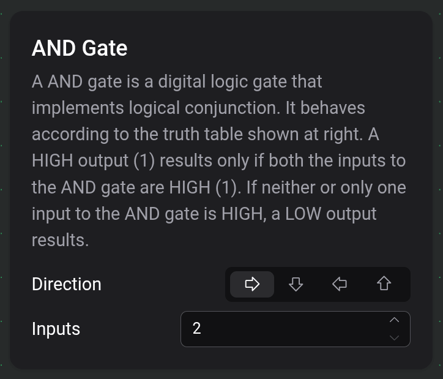
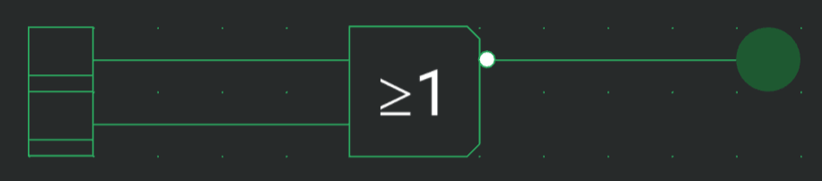

# Composants et options

Les composants sont les blocs de construction d'un circuit — portes, mémoires, entrées, afficheurs et plus encore. Cette page explique où les trouver, comment les placer et comment configurer celui que vous avez sélectionné.

## La palette de composants

La palette est le panneau de gauche. Elle liste tous les composants que vous pouvez placer, regroupés en catégories. Utilisez la zone de recherche en haut pour filtrer par nom, et cliquez sur l'en-tête d'une catégorie pour la déplier ou la replier.

- **Basique** — les blocs logiques du quotidien : **Porte NON**, **Porte ET**, **Porte OU**, **Porte XOR**, **Retard**, **Horloge** et **Tunnel**.
- **Avancé** — les blocs plus grands : additionneurs, mémoires, bascules et pièces de routage (voir le tableau ci-dessous).
- **Entrées / Sorties** — le matériel avec lequel vous interagissez pendant qu'une simulation tourne : **Bouton**, **Interrupteur**, **LED**, **Affichage à segments** et **Matrice de LED**.
- **Composants utilisateur** — vos propres pièces réutilisables. Cette section est vide jusqu'à ce que vous en construisiez une ; voir [Composants personnalisés](docs:custom-components).

Une catégorie **Ports** n'apparaît que lorsque vous modifiez un composant personnalisé. Elle contient les fiches **Entrée** et **Sortie** que vous utilisez pour définir les ports de ce composant — voir [Composants personnalisés](docs:custom-components).

Pour placer un composant, cliquez dessus dans la palette et il suit votre curseur sous forme de fantôme ; amenez-le où vous voulez et appuyez pour le déposer. Le placement reste armé pour que vous puissiez en déposer plusieurs à la suite — appuyez sur `Escape` ou choisissez un autre outil pour arrêter. Voir [Plan de travail et outils](docs:board-and-tools) pour en savoir plus sur le placement, le déplacement et la rotation.

### Basique

| Composant     | Ce qu'il fait                                                                                                                                             |
| ------------- | --------------------------------------------------------------------------------------------------------------------------------------------------------- |
| **Porte NON** | Inverse son entrée : une entrée HIGH donne une sortie LOW, et inversement.                                                                                |
| **Porte ET**  | La sortie est HIGH uniquement lorsque toutes les entrées sont HIGH.                                                                                       |
| **Porte OU**  | La sortie est HIGH lorsqu'au moins une entrée est HIGH.                                                                                                   |
| **Porte XOR** | La sortie est HIGH lorsqu'un nombre impair d'entrées sont HIGH.                                                                                           |
| **Retard**    | Transmet son entrée inchangée, en ajoutant un tick de retard de simulation.                                                                               |
| **Horloge**   | Émet une impulsion répétée d'un tick ; le délai entre les impulsions est configurable, et mettre son entrée STP à HIGH la met en pause.                   |
| **Tunnel**    | Une connexion sans fil — tous les tunnels partageant la même étiquette sont électriquement reliés. Voir [Fils et connexions](docs:wires-and-connections). |

### Avancé

| Composant                            | Ce qu'il fait                                                                                   |
| ------------------------------------ | ----------------------------------------------------------------------------------------------- |
| **Demi-additionneur**                | Additionne deux nombres de 1 bit ; S est le bit de somme, C la retenue.                         |
| **Additionneur complet**             | Additionne deux opérandes plus une retenue entrante ; S est le bit de somme, C la retenue.      |
| **ROM**                              | Mémoire morte dont vous modifiez le contenu stocké à la main.                                   |
| **RAM**                              | Mémoire vive : lit le mot adressé sur un front d'horloge, ou en stocke un tant que WE est HIGH. |
| **Bascule D**                        | Stocke un bit ; capture D sur le front montant de CLK.                                          |
| **Bascule JK**                       | Stocke un bit ; J met à 1, K remet à 0, les deux basculent, sur le front montant de CLK.        |
| **Bascule SR**                       | Stocke un bit ; S met à 1 et R remet à 0 sur le front montant de CLK.                           |
| **Générateur de nombres aléatoires** | Produit des données aléatoires sur ses sorties à chaque front montant de CLK.                   |
| **Décodeur**                         | Active la sortie dont l'index est égal à la valeur binaire présente sur ses entrées.            |
| **Encodeur**                         | Produit l'index binaire de son entrée active la plus élevée.                                    |
| **Multiplexeur**                     | Achemine vers l'unique sortie l'entrée de données choisie par les lignes de sélection.          |
| **Démultiplexeur**                   | Achemine l'unique entrée de données vers la sortie choisie par les lignes de sélection.         |

### Entrées / Sorties

| Composant                | Ce qu'il fait                                                                                               |
| ------------------------ | ----------------------------------------------------------------------------------------------------------- |
| **Bouton**               | Un bouton-poussoir momentané — cliquez dessus pendant la simulation pour émettre une seule impulsion.       |
| **Interrupteur**         | Un interrupteur à verrouillage — cliquez dessus pendant la simulation pour activer et désactiver sa sortie. |
| **LED**                  | S'allume tant que le fil qui alimente son entrée est alimenté.                                              |
| **Affichage à segments** | Affiche la valeur binaire présente sur ses entrées sous forme de nombre dans une base choisie.              |
| **Matrice de LED**       | Une grille carrée de LED qui affiche une image, écrite une ligne à la fois sur le front montant de CLK.     |

## Configurer un composant

Lorsque vous sélectionnez un seul composant placé — ou pendant que vous en placez un — une petite **carte de paramètres** apparaît près du plan de travail, montrant le nom de ce composant, une courte description et ses options ajustables. Sur un appareil tactile, les mêmes options s'ouvrent dans le tiroir **Paramètres** à la place.

### Direction — sur chaque composant

Chaque composant possède un contrôle **Direction** : quatre flèches pour l'est, le sud, l'ouest et le nord. Il oriente le composant dans le sens souhaité, ce qui revient à le faire pivoter. (Vous pouvez aussi faire pivoter une sélection sur le plan de travail avec `R` et `Shift+R` — voir [Plan de travail et outils](docs:board-and-tools).)

### Options spécifiques au type

Tout ce qui va au-delà de la Direction dépend du composant. De nombreux composants n'en ont aucune (une porte NON, par exemple). Ceux qui en ont :

| Composant                                          | Options                                                                                                        |
| -------------------------------------------------- | -------------------------------------------------------------------------------------------------------------- |
| **Porte ET / OU / XOR**, **Décodeur**              | **Entrées** — combien de ports d'entrée.                                                                       |
| **Encodeur**, **Générateur de nombres aléatoires** | **Sorties** — combien de ports de sortie.                                                                      |
| **Horloge**                                        | **Retard** — le nombre de ticks entre les impulsions.                                                          |
| **Tunnel**                                         | **Étiquette** — le nom qui l'apparie avec d'autres tunnels.                                                    |
| **ROM**                                            | **Taille de mot**, **Taille d'adresse** et **Modifier le contenu** (voir ci-dessous).                          |
| **RAM**                                            | **Taille de mot** et **Taille d'adresse**.                                                                     |
| **Multiplexeur / Démultiplexeur**                  | **Lignes de sélection** — combien d'entrées de sélection, ce qui fixe le nombre de lignes de données.          |
| **Affichage à segments**                           | **Entrées** — combien de bits d'entrée — et **Base** — la base numérique dans laquelle la valeur est affichée. |
| **Matrice de LED**                                 | **Largeur/Hauteur** — la taille de la grille de LED.                                                           |

### Modifier le contenu de la ROM

Sélectionner une **ROM** affiche un bouton **Modifier le contenu**. Il ouvre un éditeur hexadécimal où vous saisissez les mots stockés de la mémoire ; les options **Taille de mot** et **Taille d'adresse** définissent la largeur de chaque mot et leur nombre. Vos modifications sont enregistrées avec le circuit. La même vue hexadécimale en lecture seule est disponible pendant qu'une simulation tourne — voir [Inspection et surveillances](docs:inspection).

## Inverser un port

Tout port d'entrée ou de sortie peut être **inversé** afin que le signal qui le traverse soit inversé, sans ajouter de porte NON séparée. Choisissez l'outil **Fil** et touchez directement un port : une petite **bulle d'inversion** apparaît dessus, et le port est désormais inversé. Touchez-la à nouveau pour retirer la bulle.

Tant que l'outil Fil est actif, survoler à proximité d'un port prévisualise la bulle qu'un appui ajouterait, de sorte que vous voyez exactement quel port vous êtes sur le point d'inverser.

## Placer du texte

La palette ne comprend pas de texte — les étiquettes sont placées avec l'outil **Texte** de la barre d'outils. Choisissez-le, cliquez sur le plan de travail, et saisissez votre note ; la carte de paramètres de l'étiquette vous permet de **Modifier le texte** et de changer sa **Taille de police**. Les fils peuvent traverser une étiquette de texte sans s'y connecter.

## Voir aussi

- [Fils et connexions](docs:wires-and-connections) — connecter les ports en circuits fonctionnels
- [Composants personnalisés](docs:custom-components) — empaqueter un circuit dans votre propre pièce réutilisable
- [Simulation](docs:simulation) — exécuter le circuit et interagir avec les boutons, interrupteurs et afficheurs
- [Plan de travail et outils](docs:board-and-tools) — placer, sélectionner, déplacer et faire pivoter
