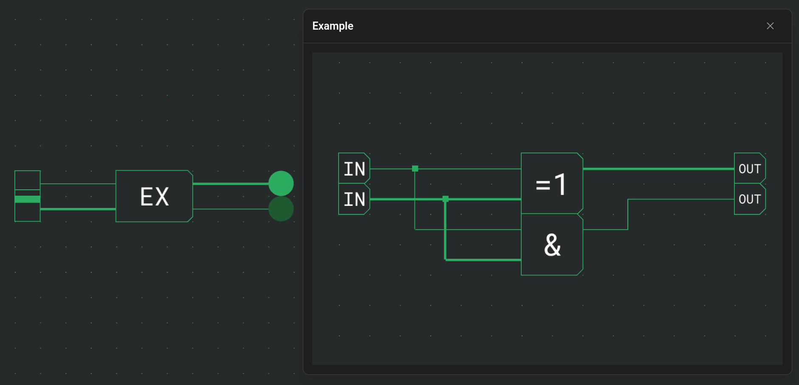
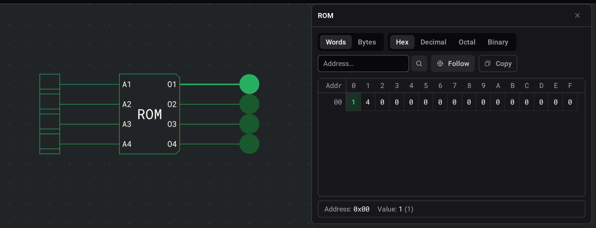
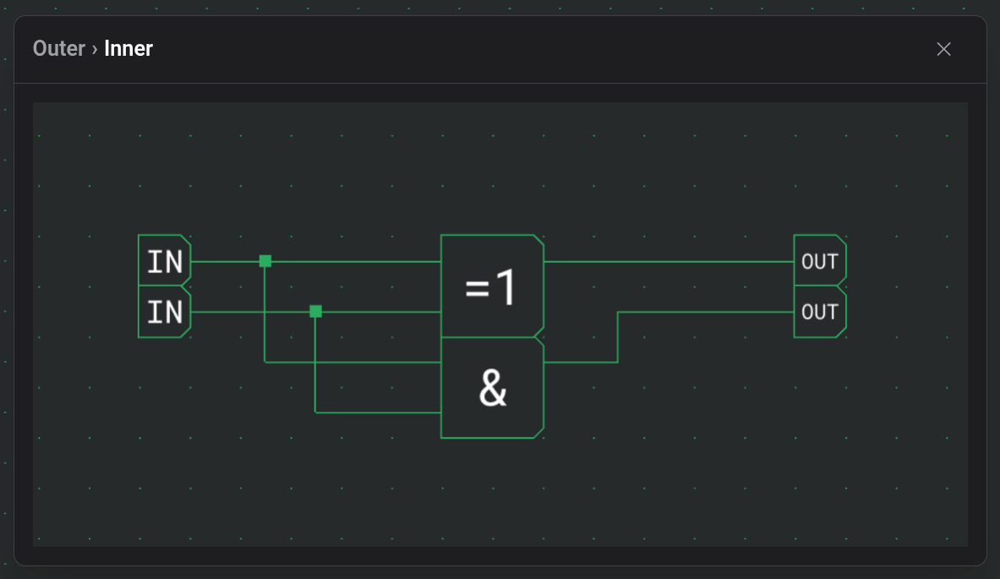

# Inspection et surveillances

Certains composants vous permettent de regarder à l'intérieur pendant que votre circuit tourne. Vous pouvez lire le contenu d'une mémoire à l'adresse qu'elle lit actuellement, ou ouvrir une vue interactive et en direct du circuit interne d'un composant personnalisé.

L'inspection n'est disponible **que pendant qu'une [simulation](docs:simulation) tourne**. Entrez d'abord en simulation, puis touchez un composant qui prend en charge l'inspection pour ouvrir sa vue. Le toucher à nouveau ramène la même vue au premier plan, et quitter la simulation ferme tout.

Sur bureau, ces vues s'ouvrent sous forme de fenêtres flottantes que vous pouvez déplacer et empiler par-dessus le plan de travail. Sur téléphones et écrans étroits, elles apparaissent à la place sous forme d'un panneau qui glisse depuis le bas, et les surveillances prennent tout l'écran — le circuit en cours d'exécution reste visible et interactif derrière elles.

## Inspecter le contenu d'une mémoire

Touchez une **ROM** pendant que la simulation tourne pour ouvrir un visualiseur en lecture seule de ses données stockées. Le mot que le circuit **adresse actuellement** est mis en évidence, et se met à jour en direct à mesure que l'adresse change, de sorte que vous pouvez suivre exactement ce que la mémoire renvoie dans le circuit.

Le visualiseur sert uniquement à la lecture — vous ne pouvez pas en modifier le contenu ici. Ses contrôles vous permettent de choisir comment les données sont affichées :

- **Mots / Octets** — montrer chaque valeur stockée en entier, ou la scinder en octets individuels.
- **Hex / Décimal / Octal / Binaire** — la base numérique dans laquelle chaque valeur est affichée.
- **Aller à l'adresse** — sauter directement à une adresse précise.
- **Suivre** — garder le mot actuellement adressé à l'écran à mesure que l'adresse se déplace.

Un indicateur **Adresse** et **Valeur** montre l'adresse du mot mis en évidence et son contenu.

## Surveiller le circuit interne d'un composant personnalisé

Touchez un [composant personnalisé](docs:custom-components) placé pendant que la simulation tourne pour ouvrir une **surveillance** — une vue en direct du circuit qu'il contient. Les fils et ports internes s'illuminent exactement comme le circuit en cours d'exécution les pilote, de sorte que vous pouvez voir ce qui se passe un niveau en dessous sans déballer le composant.

Une surveillance est interactive :

- **Pilotez ses entrées** — cliquez sur un **interrupteur** ou un **bouton** à l'intérieur du circuit surveillé pour l'actionner, tout comme sur le plan de travail principal. Cela pilote la vraie simulation en cours, de sorte que l'effet se propage au reste de votre circuit.
- **Explorez les composants imbriqués** — touchez un composant personnalisé à l'intérieur de la surveillance pour descendre dans _son_ circuit interne. Un **fil d'Ariane** en haut indique à quelle profondeur vous êtes ; cliquez sur une étape antérieure pour remonter.
- **Déplacez-vous et zoomez** — faites glisser pour vous déplacer dans la vue interne et faites défiler ou pincez pour zoomer, comme sur le plan de travail.

Si un composant ne peut pas être surveillé, vous verrez un court message : il peut n'avoir **aucun circuit interne** à inspecter, ou son circuit interne peut ne plus correspondre à la simulation en cours — dans ce cas, **redémarrez la simulation** et réessayez.

> **Écrans compacts :** les surveillances s'ouvrent en vue plein écran avec un bouton de retour à la place du bouton de fermeture de la fenêtre ; le fil d'Ariane vous permet toujours de remonter à travers les niveaux imbriqués.

## Voir aussi

- [Simulation](docs:simulation) — exécuter votre circuit et interagir avec lui
- [Composants personnalisés](docs:custom-components) — construire et utiliser des composants réutilisables
- [Composants et options](docs:components-and-options) — mémoires, interrupteurs, boutons et autres blocs de construction
