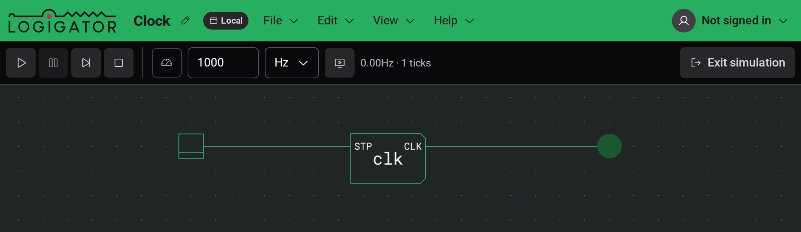

# Simulation

Une fois votre circuit construit, exécutez-le pour regarder les signaux circuler. En simulation, vous alimentez le circuit, actionnez ses entrées et voyez les résultats s'illuminer en direct sur le plan de travail.

## Démarrer et quitter une simulation

Appuyez sur le bouton **Démarrer la simulation** tout à droite de la barre d'outils pour alimenter votre circuit. Vous pouvez aussi appuyer sur `Enter`.

Pendant qu'une simulation tourne, le plan de travail est **verrouillé pour l'édition** — vous ne pouvez ni placer, ni déplacer, ni câbler, ni supprimer quoi que ce soit. Vous pouvez toujours vous déplacer et zoomer librement, et vous pouvez cliquer sur les entrées du circuit (voir [Interagir avec un circuit en cours d'exécution](#interagir-avec-un-circuit-en-cours-d-exécution)).

Pour revenir à l'édition, appuyez sur **Quitter la simulation** (là où se trouvait le bouton Démarrer), ou appuyez à nouveau sur `Enter` ou sur `Escape`.

Que la simulation démarre en **cours d'exécution** ou en **pause** dépend du réglage **Démarrage automatique de la simulation**. Lorsqu'il est activé, le circuit se met à tourner dès que vous entrez ; lorsqu'il est désactivé, il entre en pause pour que vous le lanciez vous-même. Voir [Paramètres et apparence](docs:settings).

## Les contrôles d'exécution

Lorsqu'une simulation est active, la barre d'outils échange ses outils de dessin contre les contrôles d'exécution.

| Contrôle      | Ce qu'il fait                                                                                                                 |
| ------------- | ----------------------------------------------------------------------------------------------------------------------------- |
| **Exécuter**  | Démarre (ou reprend) la simulation.                                                                                           |
| **Pause**     | Fige la simulation là où elle est, en conservant son état actuel pour que vous puissiez reprendre ou avancer pas à pas.       |
| **Pas à pas** | Fait avancer le circuit d'un seul tick. Disponible en pause — pratique pour tracer un signal une étape à la fois.             |
| **Arrêter**   | Réinitialise le circuit au début et éteint tous les fils illuminés. La simulation reste active et en pause, prête à repartir. |

**Arrêter** et **Quitter la simulation** sont différents : **Arrêter** ramène le circuit en cours au début mais vous garde en simulation, tandis que **Quitter la simulation** quitte entièrement la simulation et vous ramène à l'édition.

## Vitesse de simulation

À côté des contrôles d'exécution se trouve un ensemble d'options de vitesse et un indicateur en direct. Il y a trois façons de cadencer la simulation :

- **Synchroniser à l'image** — le circuit avance d'un tick par image dessinée, si bien que sa vitesse suit la fréquence de rafraîchissement de votre écran. C'est le réglage par défaut et il garde les circuits qui changent vite faciles à observer.
- **Limiter à la vitesse cible** — le circuit est cadencé à une fréquence fixe que vous choisissez. Saisissez un nombre dans la zone de vitesse et choisissez son unité (`Hz`, `kHz` ou `MHz`) dans la liste déroulante. Activez le bouton **Limiter à la vitesse cible** pour l'utiliser.
- **Exécution libre** — sans **Synchroniser à l'image** ni **Limiter à la vitesse cible** activé, le circuit tourne aussi vite qu'il le peut.

L'indicateur à droite montre la **vitesse mesurée** que la simulation atteint réellement (par exemple `1kHz`) ainsi que le nombre total de **ticks** écoulés depuis son démarrage. La vitesse mesurée peut rester en deçà d'une cible que vous fixez si le circuit est trop grand pour suivre.

## Interagir avec un circuit en cours d'exécution

Seules les entrées du circuit répondent aux clics pendant qu'il tourne :

- **Interrupteur** — une entrée à verrouillage. Cliquez dessus pour activer ou désactiver sa sortie ; elle reste là où vous l'avez laissée.
- **Bouton** — une entrée momentanée. Cliquez dessus pour émettre une seule impulsion sur sa sortie.

À mesure que les signaux se propagent, les fils et ports alimentés **s'illuminent**, et les composants de sortie affichent leur état — les LED brillent, les afficheurs à segments et les matrices de LED montrent leurs motifs. Faites glisser n'importe où sur le plan de travail pour vous déplacer ; cliquer dans le vide ne fait rien.

Pour regarder à l'intérieur d'un circuit en cours d'exécution — lire le contenu d'une mémoire ou observer le circuit interne d'un composant personnalisé en direct — voir [Inspection et surveillances](docs:inspection).

## Quand une simulation ne démarre pas

Certains problèmes empêchent totalement un circuit de se simuler. S'il y en a, **Démarrer la simulation** affiche un message d'erreur et reste en mode édition pour que vous puissiez les corriger. Les plus courants :

- **Un composant non pris en charge** — un composant que le simulateur ne peut pas exécuter. Retirez-le ou remplacez-le.
- **Un composant personnalisé qui se place lui-même** — un [composant personnalisé](docs:custom-components) dont le circuit interne se contient lui-même, directement ou via un autre composant personnalisé, ce qui ne peut jamais se résoudre. Cassez la boucle.
- **Un composant personnalisé sans circuit** — un composant personnalisé qui n'a rien à l'intérieur à simuler. Donnez-lui un circuit interne, ou retirez-le.
- **Une incohérence de ports** — un composant personnalisé dont les ports d'entrée/sortie déclarés ne correspondent pas aux fiches d'entrée et de sortie réellement présentes dans son circuit. Alignez les fiches avec les ports.

Chaque message nomme le composant concerné pour que vous puissiez le trouver.

## Voir aussi

- [Inspection et surveillances](docs:inspection) — lire la mémoire et observer les circuits internes en direct
- [Composants et options](docs:components-and-options) — interrupteurs, boutons, LED et autres blocs de construction
- [Composants personnalisés](docs:custom-components) — empaqueter un circuit dans une pièce réutilisable
- [Paramètres et apparence](docs:settings) — l'option Démarrage automatique de la simulation
- [Raccourcis clavier](docs:shortcuts) — tous les raccourcis et comment les modifier
