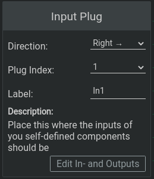
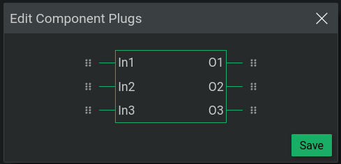

# Benutzerdefinierte Komponenten

Sie können eigene Komponenten/Subschaltungen erstellen und diese in größeren Schaltungen verwenden. Die Anzahl der Ein- und Ausgänge kann verändert werden.

Um solche Subschaltungen via `Datei > Neue Komponente` erstellen.

Geben Sie Name, Symbol und Beschreibung der Komponente ein. Das Symbol wird angezeigt, wenn Sie die Komponente in einder anderen Schaltung platzieren.

Nachdem Sie eine eigene Komponente erstellt haben, öffnet sich dies automatisch im Editor.

Sie können `Stecker Elemente` platzieren. Logigator bieten Eingangs- und Ausgangsstecker. Platzieren Sie `Eingangsstecker` für jeden Eingang, den Ihre Komponente haben soll. Alles was Sie damit verbinden, wird direkt mit allem außerhalb der Komponente verbunden.

Steckerelemente haben ein paar Optionen. Diese inkludieren `Steckerindex` und `Beschriftung`.

- Steckerindex 
    Definiert die Position des Ein/Ausgangs der Komponente, ein Steckerindex von 1 bedeutet, der ausgewählte Stecker ist der erste der Komponente.
- Beschriftung 
    Die Beschriftung ist optional und wird neben dem Ein-/Ausgang angezeigt, nachdem die Komponente platziert wurde.

Es ist auch möglich alle Steckerelemente einer Komponente auf einmal zu bearbeiten.

Um das zu machen, klicken Sie auf 'Ein- und Ausgänge bearbeiten', wenn ein Stecker ausgewählt ist. In dem Pupup das sich öffnet, können Sie die Beschriftung und den Steckerindex der einzelnen Stecker bearbeiten. Um einen Steckerindex zu ändern, verschieben Sie diesen einfach an die gewollte Position.

