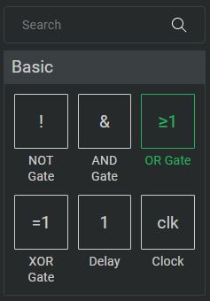

# Get Started

Logigator is a tool to create logic circuits and simulate them directly in the browser or in a native desktop application.

No matter if you are a bloody beginner or an absolute professional who needs top performance for his simulations, Logigator will help you achieve learning success very quickly - Logigator is the answer!

## Creating a Circuit Element

In order to create a circuit element select the desired element from the construction box, which is located on the left-hand side of the screen.
  

After selecting an element you can place it by clicking anywhere on the workarea.

## Editing Circuit Elements

Placed elements can be edited in the Settings box, which is located in the bottom-right corner of the screen.

There you can configure settings like the direction, amount of inputs, or amount of outputs of components.

## Zooming and Panning the View
You can zoom in and out by scrolling your mouse wheel or by pressing the `+` or `-` button in the toolbar.

To pan the view just hold down your right mouse-button and move your mouse.

## Selecting Elements
To select elements click on the desired element or drag a select-rect with your left mouse-button.

#### Select vs. Select Cut

	
	
Select

	
	
Select Cut

In `Select` mode wires will be selected to the next corner or the end of the wire. 
In contrast, in `Cut Select` Mode wires will only be selected to the edge of the selection-rectangle. Wires will be cut at this edge.

## Placing Wires

To place wires select this icon in the toolbar.

Then you can drag a new wire with your left mouse-button.

## Connecting Wires

To connect wires select this icon in the toolbar.

Click on the intersection of the wire you want to connect to to this. When you click again, the wires will be disconnected.

## Eraser

To erase elements and wires select this icon in the toolbar.

Drag your mouse while holding down your left-mouse button, to erase components and wires.

## Placing Text

To place text, select this icon in the toolbar.

Place the text-field on the workarea, just like a gate.

## Exporting Images
Images of the current circuit can be exported via `File > Export Image`.

## Shortcuts 
Most of the described actions can also be performed with shortcuts. You see and edit shortcuts via `Edit Shortcuts` in the settings menu in the top-right corner of the screen.

## Simulation Ticks
The output of every gate and element gets updated once every simulation tick.
