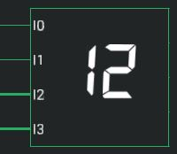
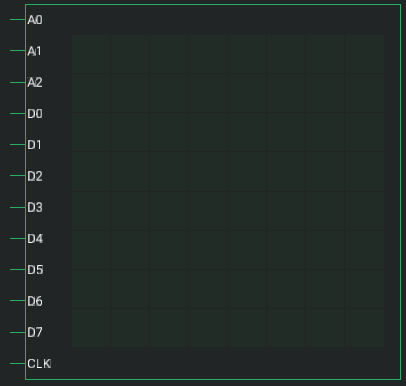

# IO Gates

## Button

Can be clicked to emit a pulse signal. Lasts one simulation tick.

## Switch

Can be switched on and off during simulation.

## LED

Switches on or off depending on the applied input.

## Segment Display

Seven segment display with a binary input, that displays the input as decimal number. 

## LED Matrix

Displays up to 256 single LEDs. It is possible to choose between the following sizes: 4x4, 8x8 and 16x16. 

 - **Address Inputs** 
   With the address inputs, the single rows of the matrix can be controlled. When using a 16x16 Matrix, each row is spilt into two addresses (the first 8 LED, the last 8 LEDs).
 
 - **Data Inputs** 
   The Matrix has between 4 and 8 data Inputs (D0-D7). D0 is the first LED of the row and D7 is the last LED of the row. A 16x16 Matrix also has only 8 Data Inputs. Because of that, every row consists of two addresses. 

 - **Clock** 
   When CLK is HIGH, the data is written to the Matrix. 

