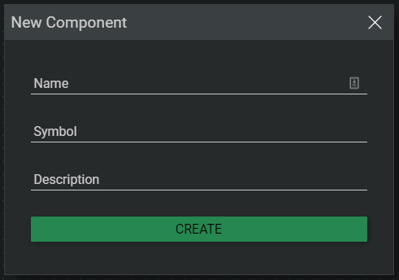
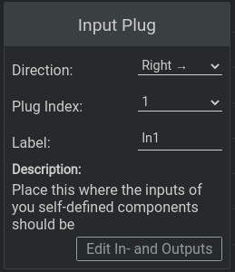
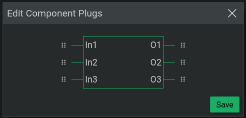

# User Defined Components - Subcircuits

You can create subcircuits/components and use it in larger circuits. The amount of inputs and outputs of the subcircuit can be modified.

In order to create such subcircuits select `File > New Component`.

Input a name, a symbol and a description for the component. The symbol will be rendered on the component after you place it in another circuit.

After you created your component, it will automatically be opened in the editor.

You can place so called `Plug Elements` in your components. Logigator provides input and output plug elements. Place one `Input Plug` for every input your component should have. Everything you connect to this will be directly connected to everything connected to it outside the component.

Plug elements have a few options. These options include a 'Plug Index' and a 'Label'.

- Plug Index 
    Defines the position of the input or output on the component, a Plug Index 1 means the selected input is the first input of the component.
- Label 
    The label is optional and is rendered next to the input when the component is placed on a circuit.   

It is also possible to batch edit options of all plugs in a component.

To do so click on 'Edit In- and Outputs' when a plug is selected. This will bring up a popup, where you can change the labels and plug-index of all plugs. To change a plug-index just drag the desired plug to the wanted position.

