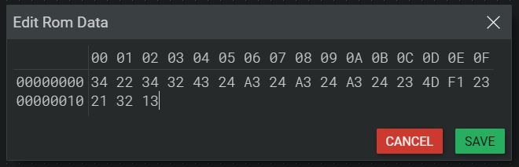

# Advanced Gates

## Half Adder

| A   | B   | Sum | Carry |
| --- | --- | --- | ----- |
| 0   | 0   | 0   | 0     |
| 1   | 0   | 1   | 0     |
| 0   | 1   | 1   | 0     |
| 1   | 1   | 0   | 1     |

Adds two single binary digits. `Sum` is the single digit sum of the addition. `Carry` represents the overflow.

## Full Adder

| A   | B   | Cin | Sum | Carry |
| --- | --- | --- | --- | ----- |
| 0   | 0   | 0   | 0   | 0     |
| 0   | 0   | 1   | 1   | 0     |
| 0   | 1   | 0   | 1   | 0     |
| 0   | 1   | 1   | 0   | 1     |
| 1   | 0   | 0   | 1   | 0     |
| 1   | 0   | 1   | 0   | 1     |
| 1   | 1   | 0   | 0   | 1     |
| 1   | 1   | 1   | 1   | 1     |

Adds three single binary digits.

## ROM

`Read only Memory` - Data can be written in hexadecimal.
Can be used for program code, for example.

## D Flip-Flop

| D   | Q   | Q Inverse |
| --- | --- | --------- |
| 1   | 1   | 0         |
| 0   | 0   | 1         |

`Data` or `Delay` Flip-Flop - Holds a state. When (CLK) is set high, (Q) gets set to (D). (Q Inverse) always is the inverse of (Q).

## JK Flip-Flop

| J    | K    | Q         | Q Inverse |
| ---- | ---- | --------- | --------- |
| 1    | 1    | Toggle    | Toggle    |
| 1    | 0    | 1         | 0         |
| 0    | 1    | 0         | 1         |
| 0    | 0    | No change | No change |

Holds a state. (J) represents `set`, (K) represents `reset`. As soon as (CLK) is set high, (Q) sets high if (J) is set high and sets low if (K) is set high. (Q) does not change when both (J) and (K) are low, toggles when both are set high.

## SR Flip-Flop

| S    | R    | Q         | Q Inverse |
| ---- | ---- | --------- | --------- |
| 0    | 0    | No change | No change |
| 1    | 0    | 1         | 0         |
| 0    | 1    | 0         | 1         |
| 1    | 1    | Invalid   | Invalid   |

Holds a state. (S) represents `set`, (R) represents `reset`. As soon as (CLK) is set high, (Q) sets high if (S) is set high and sets low if (R) is set high. (Q) does not change when (J) and (K) are the same.

