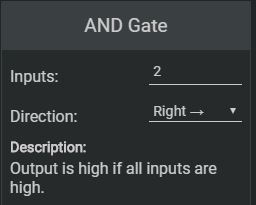

# Get Started

Logigator is a tool to create logic circuits and simulate them directly in the browser or in a native desktop application.

No matter if you are a bloody beginner, Logigator will help you achieve learning success very quickly, or an absolute professional who needs top performance for his simulations - Logigator is the answer!

## Creating a Circuit Element

In order to create a Circuit Element select the desired Element from to construction box, located on the left-hand side of the editor.
  

After you selected an Element you can place it by clicking anywhere on the workarea. 

It's also possible to drag the Element before placing it. To do so hold down your mouse button and move your mouse, the Element will be placed when you release the mouse button.

## Editing Circuit Elements

Placed Elements can be edit in the Settings box located in the bottom-right corner of the screen.

There you can configure settings like the direction, amount of inputs, amount of outputs of components.

## Zooming and Panning the View
You can zoom the view by scrolling your mouse wheel or by pressing the `+` or `-` button in the toolbar.

To pan the view just hold down your right mouse-button and move your mouse.

## Selecting Elements
To select Elements click on the desired Element or drag a select-rect with your left mouse-button.

#### Select vs. Select Cut

	
	
Select

	
	
Select Cut

In Select Mode wires will be select to the next corner or the end of the wire. 
In contrast, in Cut Select Mode wires will only be selected to the end of the Select-rect. There wires will be cut of. 

## Placing Wires

To place wires select this icon in the toolbar.

Then you can drag a new wire with you left mouse-button.

## Connecting Wires

To connect wires select this icon in the toolbar.

Then you can click on intersection of wires, to connect them. If you click again, the wires will be disconnected.

## Placing Text

To place text select this icon in the toolbar.

Then you can click anywhere on the view to place text.

## Exporting Images
Images can be exported by clicking: File > Export Image, in the correct file format.

Images can be exported in the following Formats: SVG, PNG, JPEG.

## Shortcuts 
Most of the described actions can also be performed with shortcuts. You can see and edit shortcuts by clicking the Edit Shortcuts Button in the Settings Menu on the top-right corner of the editor.
