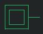
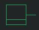

# IO Gates

## Button

Can be clicked to emit a pulse signal. Lasts one simulation tick.

## Switch

Can be switched on and off during simulation.

## LED

Switches on or off depending on the applied input.

## Segment Display

Seven segment display with a binary input, that displays the input as decimal number. 

