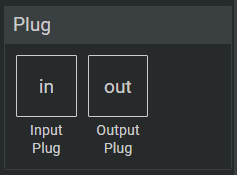

# User Defined Components - Subcircuits

You can create subcircuits/components and use it in larger circuits. You can also modify the amount of inputs and outputs of the subcircuit.

In order to create such subcricuits select `File > New Component` from the menu.

Then you can input a name, a symbol and a description for the component. The symbol will be rendered on the component when you place it in another circuit.

After you created your component it will automatically be opened in the editor.

You can place so called 'Plug Elements' in you custom components. Logigator provides input and output plug elements.

Plug elements have a few options. These options include a 'Plug Index' and a 'Label'.

- Plug Index 
    Defines the position of the input or output on the component, a Plug Index 1 means that the selected input is the first input of the component.
- Label 
    The label is optional and is rendered next to the input when the component is placed on a circuit.   

